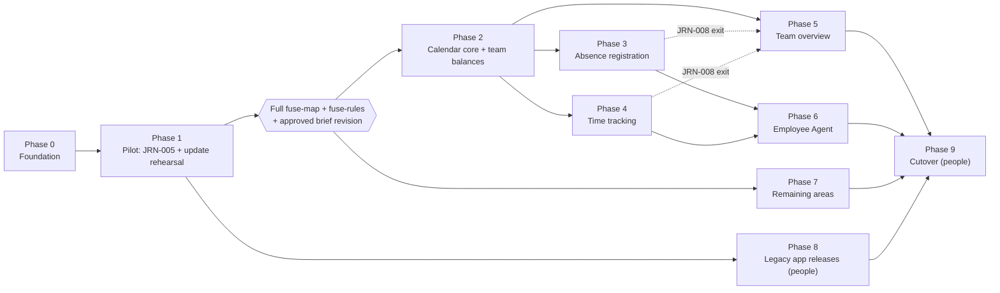

# work-app: Fusion Brief

**Status: draft for approval.** Nothing is built before it is approved. This brief is a hypothesis: Phase 1 is a
pilot, and what the pilot surfaces is expected to revise it.

**You steer by editing this file.** Change a phase's capabilities, order or criteria here, then re-run the approval.
The build commands read the phases below exactly as written. They may tick a box or add a `Proposed revision:` line,
but they never reword a criterion.

| Input | Last changed (2026-09-28, UTC+3) |
|---|---|
| `program.json`, `INTENT.md` | 20:15:24 |
| `PREFLIGHT.md` | 20:16:32 |
| `overlap.json` | 20:17:34 |
| `ASSESSMENT.md` | 20:26:34 |
| `capabilities.json`, `CAPABILITIES.md` | 20:38:59 |
| `rules.json`, `BUSINESS_RULES.md` | 21:41:07 |
| `platform.json`, `PLATFORM.md` | 21:42:35 |
| `DECISIONS.json`, `traceability.json`, `design/design.json` | **absent** (no decisions recorded, no Figma design) |

> **Read this first: what this brief covers.**
> - **Most of both apps is not mapped yet.** The capability map (`fuse-map`) ran on 4 shards: vmm's calendar
>   components and me-ios's Calendar feature. That is about 24k of roughly 500k code lines, so the plan below covers
>   the **calendar, time, absence, balances, payslip-list and claims-list slice** (29 capabilities, 8 journeys).
> - **Not yet planned:**
>   - Manager's approvals, AutoPay, HRM employees and dialogues, OSR, Business NXT and Gaia.
>   - Employee's expenses (receipts, mileage, allowances), payslip detail, Dottie HR, personal information, inbox,
>     settings and app lock, and the share extension.
>   - Phase 7 holds their place, and Phase 2 cannot start until they are mapped and the brief is revised.
> - **Approving "every phase" today would approve a plan that cannot reach cutover.** Approving Phase 0 and Phase 1
>   is sound.
> - **Other inputs are also incomplete:**
>   - All 5 preflight questions and every intent answer are defaults from a headless run.
>   - No decisions are recorded.
>   - There is no Figma design, so **every capability is "no design"**.

---

## 1. Objective

Replace **Visma Manager (vmm)**, a React Native app for iOS and Android, and **Visma Employee (me-ios)**, a native
Swift app for iOS only, with **one app for iOS and Android**.
- **Who uses it.** The people who use Manager today (managers and approvers at Nordic and Dutch Visma customers) and
  the people who use Employee today (employees on Visma.net Payslip, Expense and Calendar). One person can be both.
- **Why.** Two products serve two roles of the same person at the same companies, through the same Visma Connect
  identity and the same Mobile Employee backend. They share no code, no design system and no stack.
- **Why now.** Both codebases carry heavy structural debt, so continuing both means paying that debt twice
  (ASSESSMENT §6):
  - Manager has four network stacks and a global store singleton.
  - Employee has two DI systems, a half-finished UIKit-to-TCA migration and a deprecated database (Realm).
  - Employee has no Android version at all.
- **The recommended strategy is a greenfield app** that ports capabilities from both, with every legacy behavior
  proven or consciously changed (ASSESSMENT §7).

## 2. Target stack decision (ADR-001)

**Status: Recommendation, to be confirmed by the approval.** `program.json` has `target.stack: undecided`, and no
`stack` decision is recorded.

### Context

- **Sources.**
  - vmm: React Native 0.86 (New Architecture), TypeScript, Redux Toolkit plus redux-observable, React Navigation 7,
    10 Maestro flows, iOS and Android.
  - me-ios: Swift 6, UIKit plus TCA, 38 local SwiftPM packages, iOS 18 minimum, iOS only.
- **Team skills: unknown.** PREFLIGHT question 4 is unanswered. Presumably a TypeScript/React Native team (vmm) and a
  Swift/TCA team (me-ios).
- **Native features in use.**
  - Notification Service and Content extensions (vmm, Swift).
  - A share extension (me-ios) that shares tokens through an app group.
  - Actionable notification categories and Android channels.
  - App lock with Face ID and passcode.
  - Camera with document crop, location with Google Maps.
  - Speech input, device-calendar write, BankID scheme query.
- **Background modes:** only vmm's, and they are vestigial (ASSESSMENT §3.1). No widgets, no watch app.
- **Platforms:** iOS and Android for both personas. Employee's Android users do not exist today, so every Employee
  capability is new on Android.

### Options

| | A. React Native (bare, New Architecture) | B. Native pair (SwiftUI + Jetpack Compose) | C. Kotlin Multiplatform (shared logic, native UI) | D. Flutter |
|---|---|---|---|---|
| **Reuse** | vmm's toolchain, CI, Fastlane, Maestro flows and team carry over. vmm's *architecture* does not: one API client, no RxJS, no global store. Employee capabilities are re-implemented from Swift | me-ios's Swift request types and domain models can be lifted into the iOS half. Nothing is reused for Android, where both personas are written from scratch in Compose | Rules and API clients written once in Kotlin. No existing Kotlin code to reuse. vmm's Android is React Native, not Kotlin | Nothing reused from either app |
| **Platform features** | The extensions stay native Swift targets, as in vmm today. App lock, Keychain migration and the Realm import are small native modules | Best access to every platform API, no bridge | Native UI, so the same as B for features | Extensions stay native. Plugins cover the rest |
| **Performance** | Enough for list and calendar UI (vmm proves it). Month grids need care (FlashList, memoized cells) | Best | As B | Good |
| **Cost of the proof** | One implementation, and one test suite per capability, run on both platforms | **Every capability twice.** The proof judges both halves, and a capability built on one platform is PARTLY PROVEN at best | Shared tests for logic, and two UI layers | One implementation |
| **Team and hiring** | Keeps the vmm team productive. The me-ios team moves to TypeScript, and its Swift skills stay needed for extensions and native modules | Keeps the me-ios team productive on iOS. Needs an Android (Kotlin) team that neither app has | Both teams learn Kotlin | Both teams retrain |

### Decision

**Recommendation: A, React Native (bare).** A person confirms or changes it at approval (`decisions.py`, kind
`stack`).
- It is the only option where one implementation serves both platforms and an existing team, toolchain and test
  harness carry over.
- The native surface is modest and already lives in native targets either way.
- Doubling every capability (B), or retraining both teams (C, D), costs more than it returns for list-and-form
  business apps.
- **Revisit** if PREFLIGHT shows that the combined team is mostly Swift and no one owns Android. B, with the iOS half
  first, then becomes worth comparing.

**Consequences.**
- State and data: TanStack Query holds server state, and one small library (Zustand) holds client state. No Redux
  and none of vmm's RxJS layer.
- Tokens go in the Keychain via `react-native-keychain`, and non-sensitive state in MMKV.
- Native Swift targets: the Notification Service and Content extensions and the share extension. Native modules: the
  one-time Keychain migration, the read-only Realm import (CONTINUITY §3) and app lock.

## 3. Target architecture

### 3.1 Containers

```mermaid
C4Container
    title work-app: containers (mapped slice solid; later areas listed)
    Person(emp, "Employee", "Registers time and absence, checks balances, payslips, claims")
    Person(mgr, "Manager", "Watches team presence, calendars and balances")
    System_Boundary(app, "New app (React Native, iOS + Android)") {
        Container(shell, "App shell", "TypeScript", "Role-aware navigation, auth, context switcher, linking config")
        Container(features, "Feature modules", "TypeScript", "calendar, absence, time, balances, team, agent, pay, expenses")
        Container(found, "Foundations", "TypeScript", "Design system, API clients, i18n (6 locales), analytics, flags, secure storage")
        Container(native, "Native targets", "Swift / Kotlin", "Notification Service + Content ext., share ext., app lock, one-time Keychain and Realm import")
    }
    System_Ext(idp, "Visma Connect", "OIDC + PKCE identity")
    System_Ext(meapi, "Mobile Employee API", "mobileemployee.visma.net: session, calendar, absence, time, chatbot, payslips, claims")
    System_Ext(apim, "API Manager", "Roles, odp/user/info, Gsid session")
    System_Ext(cal, "Calendar API", "calendarBase: an employee's balances and summaries")
    System_Ext(later, "Later backends (not mapped)", "Approval, AutoPay, Dialogue, OSR, Business NXT GraphQL, Gaia assistant")
    System_Ext(sdk, "Third-party SDKs", "Firebase (Messaging, Crashlytics, Analytics, RC), Snowplow, Survicate")
    Rel(emp, shell, "Uses")
    Rel(mgr, shell, "Uses")
    Rel(shell, features, "Routes to")
    Rel(features, found, "Uses")
    Rel(found, idp, "Signs in", "OIDC")
    Rel(found, meapi, "Calls", "HTTPS, Bearer, HATEOAS links")
    Rel(found, apim, "Roles and Gsid", "HTTPS")
    Rel(found, cal, "Calls", "HTTPS, Bearer + Gsid")
    Rel(found, later, "Later phases", "HTTPS / GraphQL")
    Rel(found, sdk, "Reports to")
    Rel(native, found, "Shares tokens via app group")
```

### 3.2 Module map

The modules follow capabilities and domains, never the old apps' folders. A capability's module is
`src/features/<domain>/<capability-slug>/`, which is also the build step's write scope.

| Domain | Module | Capabilities |
|---|---|---|
| Calendar | `src/features/calendar/` | CAP-001–006 |
| Absence registration | `src/features/absence/` | CAP-012–017 |
| Time tracking | `src/features/time/` | CAP-018–020 |
| Balances | `src/features/balances/` | CAP-009–011 |
| Team overview | `src/features/team/` | CAP-007, CAP-008 |
| Employee Agent | `src/features/agent/` | CAP-021–027 |
| Expenses | `src/features/expenses/` | CAP-028 (later: receipts, mileage, allowances) |
| Pay | `src/features/pay/` | CAP-029 (later: payslip detail, year-end reports) |

**Shared calendar model.** CAP-001 to CAP-005 are one calendar component with a **subject**: "me", or "a team
member" for managers. The component is never two copies. The subject decides the endpoint:
- me-ios's own-calendar feed for "me"
- `calendar/my-employees/feed` for "a team member"

The subject also decides the permission check.

### 3.3 Navigation shell per persona

| Persona | Tabs (mapped slice) | Entry points |
|---|---|---|
| Employee only | Start (CAP-011, CAP-017), Calendar (own: CAP-001–006, CAP-010, CAP-012–020; Agent button: CAP-021–027), Pay (CAP-029), Expenses (CAP-028), Settings | Push: timesheet reminder opens Confirm time (CAP-020). Push: new payslip opens Pay |
| Manager only | Start (CAP-008), Team (a team member's calendar CAP-001–005 and balances CAP-009), Settings (calendar sync CAP-007) | Later: Approval, AutoPay, HRM, OSR tabs, as vmm's `navConfig.tsx:91-96` builds them from roles today |
| Both roles | Start shows both personas' cards. The Calendar tab has a **Me / Team** switch. Pay and Expenses as for employees | The same as both lists above |

- **Company context.** me-ios's permissions are **per company context** (`currentSession.contexts[].permissions`), and
  its users can hold several accounts. The shell keeps a context switcher, and every role check is evaluated for the
  active context.
- **Tabs with no role.** A tab appears only when the person has a role that needs it. A person with no role at all
  gets vmm's "no roles" screen (`navConfig.tsx:184`).

### 3.4 Role matrix

**What decides a person's role.**
- **Manager roles** come from API Manager `GET Roles` (vmm `src/services/apiManagerConnect/apiManagerConnect.ts:308-320`):
  `Hrm_User`, Approval, OSR, AutoPay and Dialogue roles (`src/consts/constants.ts:37`).
- **Employee permissions** come from the Mobile Employee API `GET authorization/currentSession`, per company context
  (me-ios `EmployeeServices/UserService/Sources/UserService/Model/UserResponse.swift:26`, `TabbarCoordinator.swift:52-70`).
- The new app calls both after sign-in and derives **Manager** and **Employee** from them.

| Capability | Employee (own data) | Manager (team data) | Decides it | Status |
|---|---|---|---|---|
| CAP-001–005 calendar | ✅ with any calendar permission (`addTime`, `addAbsence`, `confirmTime`, `time/absence` read-only or write) | ✅ a team member's calendar | Employee: calendar permissions. Manager: **open**. vmm registers the screen in both the HRM and Approval stacks, so `Hrm_User` or an Approval role | Open (`roles` decision on CAP-001) |
| CAP-006, CAP-012–016 register, view, edit, delete | ✅ with write permission, and only where the server sends `rel=update`/`rel=delete` links | ❌ | Permission plus HATEOAS links | As legacy |
| CAP-007 birthday and anniversary sync | ❌ | ✅ with `Hrm_User` | `Hrm_User` | Scope open (dormant, dev flag) |
| CAP-008 absent today | ❌ | ✅ | **Open**: the map shows no role check. The endpoint returns 403 for most manager tokens | Open (`roles` decision on CAP-008) |
| CAP-009 an employee's balances | ❌ | ✅ with `Hrm_User` | `Hrm_User`. vmm reaches it from HRM employee detail; the new app reaches it from a team member's calendar (Phase 2) | As legacy |
| CAP-010, CAP-011, CAP-017 own balances, vacation cards | ✅ with calendar permissions | ❌ | Calendar permissions | As legacy |
| CAP-018–020 check-in, confirm time | ✅ (`confirmTime` for CAP-020) | ❌ | Permissions | As legacy |
| CAP-021–027 Employee Agent | ✅ with calendar permissions | ❌ | Calendar permissions | As legacy |
| CAP-028 claims list | ✅ with `expenseClaims`, plus `dataSource.isEnabled` | ❌ | Permission, plus an unknown switch (RULE-048) | Open (RULE-048 question) |
| CAP-029 payslips list | ✅ with `payslips` | ❌ | Permission | As legacy |

**No capability is shown to a role that never had it.** The only new combination is the person with both roles:
Me / Team on one calendar (CAP-001–005). That needs a `roles` decision on CAP-001 before Phase 3.

**Negative tests, one per role (every phase that builds a gated capability adds its own):**
- An **employee-only** account never reaches Team, another person's calendar, CAP-007, CAP-008 or CAP-009.
- A **manager-only** account (no Employee context) never reaches registration, check-in, the Agent, Pay or Expenses.
- An account without `Hrm_User` never reaches CAP-009 or CAP-007.
- An account without `confirmTime` never sees Confirm time (CAP-020).
- A person with both roles in company X, and only the employee role in company Y, sees Team only while X is active.

### 3.5 Shared foundations (Phase 0)

- **Design system.** There is **no Figma design yet**, so no tokens to generate. Phase 0 creates a token file with
  placeholder values and components that take tokens only, so that the Figma tokens replace the values later without
  touching features. Until a design exists, each capability needs a `gap` decision: `carry-as-is` (follow the legacy
  screen) or `design-it`.
- **API clients.** One client per backend, each with its own base URL from config: Mobile Employee, API Manager and
  Calendar, with the later backends added in later phases.
  - One auth interceptor and one refresh path. A 401 means refresh; a 403 means forbidden, never "token expired"
    (fixes vmm debt 4).
  - HATEOAS links are followed as the server sends them (PLT-076).
  - No environment switch in release builds (fixes vmm debt 2 and me-ios debt 7).
- **Auth.** Visma Connect OIDC + PKCE with system browser sessions, and the client choice from CONTINUITY §2. Tokens
  are in the Keychain `…ThisDeviceOnly` and in the Android Keystore.
  - **A failed refresh never loses where the user was going.** When a refresh fails (for example, the token was issued
    to another client, or it was never migrated), the app keeps the pending route and the account it belongs to. It
    shows sign-in with the login hint, then opens that route for that account and restores the Me / Team subject.
    Phase 0 proves it with a push route opened on an expired token.
  - **One cache per account.** Server-state query keys include the account, the company context and the calendar
    subject. Sign-out and account switch purge them.
- **Storage.** Keychain and Keystore for secrets, MMKV for preferences. **No local database** in the mapped slice:
  everything is re-fetched. A database decision comes with receipt drafts (Phase 7).
- **Analytics.** `track(event, props)` keeps the legacy wire names per capability, and adds `source_app` and
  `migrated_from` (CONTINUITY §6).
- **Flags.** One vendor (open question), with a kill switch per capability.
- **i18n.** The **union of locales**: `da`, `en`, `fi`, `nb`, `nl`, `sv`.
  - Only vmm has `nl`, so Employee's strings need Dutch translations, or `nl` is limited to Manager screens (open
    question).
  - vmm has 486 keys untranslated per locale today. Parity is judged against what legacy actually ships.
- **Linking.** A route table from day one (CONTINUITY §5).

### 3.6 Non-functional requirements

These are defaults. PREFLIGHT question 4 (constraints) is unanswered, so a person confirms them.

| Area | Requirement |
|---|---|
| Minimum OS | Android 24, as vmm. **iOS: open.** Manager supports 15.1 and Employee 18.0. The recommendation is the lowest version the chosen React Native release supports, unless Manager's OS analytics show negligible use below a higher floor |
| Accessibility | WCAG 2.1 AA for every new screen (European Accessibility Act, in force in the EU since June 2025): Dynamic Type and font scaling, VoiceOver and TalkBack labels on every control, 44 pt targets, contrast. Checked in each phase's visual sign-off |
| Offline | Read-only screens show the data loaded in the current session with a "not updated" state. Showing cached data after a cold start needs a persisted, encrypted cache per account, which is an open question (Appendix A, M2). Writes (registration, check-in, confirm) need a connection, as in legacy. The mapped legacy code queues nothing offline, so a new offline queue is **not** built |
| Security | Tokens in the Keychain and Keystore only, app lock carried over (Phase 7), no Airtable or Seatable device tokens, no LLM prompts in client config, no persisted request logs with auth headers. `fuse-harden` runs before cutover |
| App size and startup | Tracked from Phase 0 in CI (IPA/AAB size, cold start on a mid-range Android device). Gated in Phase 0 (CI publishes them) and Phase 1 (a person records budgets). The one-time Realm import module gets a removal version, so realm-core does not stay in the binary |
| Privacy | One privacy manifest and one Data safety form: the union of both apps (PLT-035) |

### 3.7 Capabilities to modules to legacy implementations

| Capability | New module | vmm (Manager) | me-ios (Employee) |
|---|---|---|---|
| CAP-001 month view | `calendar/month-view` | `src/screens/EmployeeCalendarScreen/EmployeeCalendarScreen.tsx` (mock data) | `Modules/CalendarFeature/…/CalendarGridFeature.swift` |
| CAP-002 list view | `calendar/list-view` | `EmployeeCalendarScreen.tsx:160-218` (mock data) | `Modules/CalendarFeature/…/CalendarViewController.swift` |
| CAP-003 switch views | `calendar/view-switch` | `components/CalendarOptionsMenu/CalendarOptionsMenu.tsx` | `CalendarContainerViewController.swift` |
| CAP-004 day details | `calendar/day-detail` | `components/EmployeeCalendarDayDetail.tsx` | `…/DayDetailFeature` |
| CAP-005 customize | `calendar/filters` | `CalendarOptionsMenu.tsx` | `…/CalendarFilterPreferences.swift` |
| CAP-006 start registration | `calendar/start-registration` | — | `CalendarViewController.swift` |
| CAP-007 birthday sync | `team/calendar-sync` | `src/hooks/useSyncCalendar.ts` | — |
| CAP-008 absent today | `team/absent-today` | `queryEndpointsCalendar.ts:35-69` | — |
| CAP-009 employee balances | `balances/employee-balances` | `src/services/apiCalendar/apiCalendar.ts:211-381` | — |
| CAP-010 my month balances | `balances/month-balances` | — | `…/BalancesOverview/…` |
| CAP-011 vacation on start | `balances/vacation-card` | — | `EmployeeServices/Calendar/…/CalendarService.swift:57-64` |
| CAP-012 register | `absence/register` | — | `…/AbsenceRegistration/AddAbsenceCoordinator/…` |
| CAP-013 dimensions | `absence/dimensions` | — | `…/DimensionValueItemSelectorViewModel.swift` |
| CAP-014 view absence | `absence/view` | — | `…/Absence/AbsenceViewTableViewController…` |
| CAP-015 edit absence | `absence/edit` | — | `…/AbsenceRegistrationCoordinator…` |
| CAP-016 delete absence | `absence/delete` | — | `…/AbsenceRegistrationService.swift:93-103` |
| CAP-017 vacation cards | `absence/start-cards` | — | `Employee/StartPage/Tasks/GetCalendarItemsTask.swift` |
| CAP-018 check in/out | `time/check-in` | — | `…/TimeService.swift:128-202` |
| CAP-019 edit check-in | `time/edit-check-in` | — | `…/EditCheckoutRegistrationCoordinator.swift` |
| CAP-020 confirm time | `time/confirm` | — | `…/ConfirmTimeUseCase.timeService.swift` |
| CAP-021–027 Employee Agent | `agent/<slug>` | — | `Modules/CalendarFeature/…/Chatbot/…` |
| CAP-028 claims list | `expenses/claims-list` | — | `Employee/CalendarLeftover/ClaimsCalendarViewModel.swift` |
| CAP-029 payslips list | `pay/payslips-list` | — | `Employee/Payslips/PayslipsCalendarViewModel.swift` |

## 4. Phased sequence

The phases are ordered by risk and dependency:
- **Phase 0** is the foundation. It already proves one sign-in reaching every backend family.
- **Phase 1 is a pilot.** It is one complete journey plus the first **update-in-place rehearsal** on real legacy
  builds. What it surfaces is expected to revise this brief.
- **Phases 2 to 6** go by domain. **They start only after the full map and an approved revision** (Phase 2 entry).
- **Phase 7** holds the areas that are not mapped yet.
- **Phase 8** is the legacy-release track: the Employee pre-cutover update and the vmm sunset update. People carry it
  out, in parallel with the build, from the end of the pilot.
- **Phase 9** is cutover, which people carry out.

**Scale** is a size relative to the other phases, never a duration.

**Why this pilot.** JRN-005 (CAP-010, CAP-028, CAP-029) is the only complete journey of 1 to 3 capabilities in the
map. It is read-only and has no conflicts. It exercises paging, strings, analytics and a Maestro journey on both
platforms.
- The **Manager** backend family is proven in Phase 0: a live contract test of `Roles`, then `Gsid`, then the Calendar
  API.
- Both personas are proven through the role-aware shell. The pilot adds a positive test for the person with both roles.
- The **riskiest thing in the whole program is continuity**: whether existing users keep their session. So the pilot's
  exit requires installing the new build over the real App Store Employee build and the real Play Manager build.

It deviates from "a pilot exercises both personas' capabilities" on purpose. No mapped Manager capability is reachable
without the unmapped HRM employee list (CAP-009 needs an employee id from HRM detail). So CAP-009 moves to Phase 2,
reached from a team member's calendar.



#### Phase 0 — Foundation
Command: /app-fusion:fuse-scaffold
Capabilities: none
Journeys: none
Scale: M
Risk: High; (1) one Visma Connect client may not reach every backend family (two client ids and two header schemes today), mitigated by a live contract test in this phase's exit criteria; (2) the shell's account, cache and push models depend on undecided continuity choices, mitigated by requiring those decisions before the scaffold starts.
Entry criteria:
- [ ] `SIGNOFF.json` records an approval of this brief covering Phase 0
- [ ] A `stack` decision is recorded in `DECISIONS.json` and `program.json` `target.stack` is not `undecided`
- [ ] `PREFLIGHT.md` or `DECISIONS.json` records whether an Android Employee app exists, with its application id if it does
- [ ] A `continuity:store-identity` decision is recorded, it cites monthly active users per app and platform, and `program.json` `storeIdentity` is not `undecided`
- [ ] A `continuity:sign-in-client` decision (extend Employee's Visma Connect client, or a new client) and a `continuity:gsid` decision (where the new app gets its `Gsid`) are recorded in `DECISIONS.json`
- [ ] A `continuity:multi-account` decision is recorded in `DECISIONS.json`
- [ ] A `continuity:firebase-project` decision names one Firebase project with both of the new app's ids registered in it
- [ ] Decisions are recorded for PLT-002 (minimum OS), the flag vendor (PLT-036/047/055), the crash reporter (PLT-045/046) and the analytics destinations (PLT-037/038)
- [ ] PREFLIGHT questions 2, 3, 4 and 5 are answered in `PREFLIGHT.md`
Exit criteria:
- [ ] `new-app/work-app/docs/fusion/SCAFFOLD.md` exists and names the bundle id and application id that the store-identity decision chose
- [ ] The iOS and Android deployment targets match the PLT-002 decision
- [ ] Under store identity B or D, the iOS app entitlements include app group `group.com.visma.vme.payslip.shared`
- [ ] The app builds and launches on an iOS simulator and an Android emulator, and the Maestro smoke flow passes on both
- [ ] A live contract test signs in once with the decided client and a test account that has both roles, then gets `Roles` and `odp/user/info` from API Manager, a `Gsid`, `authorization/currentSession` from the Mobile Employee API, and one Calendar API balances response
- [ ] A unit test shows the role derivation from a `Roles` response and a `currentSession` response, including a person with both roles and a person with none
- [ ] Server-state query keys include the account, the company context and the calendar subject; a unit test shows account A's data never renders while account B is active, and that sign-out and account switch purge the cache
- [ ] A Maestro flow opens a push route with an expired refresh token: the app shows sign-in with the login hint, then lands on the intended route for the push's account
- [ ] `src/app/routes.ts` lists one route per notification type in PLT-079, and a Maestro `openLink` flow passes for each
- [ ] The notification categories and Android channels of PLT-079 are declared with their legacy identifiers
- [ ] A remote kill switch hides a tab, and a forced crash appears symbolicated in the decided crash reporting project
- [ ] The i18n catalogs contain the locales da, en, fi, nb, nl and sv
- [ ] One API client module exists per backend (Mobile Employee, API Manager, Calendar), and no source file outside `src/api/` holds a base URL
- [ ] CI publishes the IPA and AAB sizes and a cold-start time on an Android emulator for every build

#### Phase 1 — Pilot: pay, claims and balances, plus the first update rehearsal
Command: /app-fusion:fuse-build
Capabilities: CAP-010, CAP-028, CAP-029
Journeys: JRN-005
Scale: M
Risk: High; (1) existing users lose their session on update (me-ios erases its Keychain when a UserDefaults marker is missing, `StorageService.swift:118-127`), mitigated by rehearsing the update in place over real store builds in this phase; (2) the payslips and claims feed URLs are not resolved in the map, mitigated by reading `PayslipsPagingControllerDataSource` and `ClaimsPagingControllerDataSource` before porting.
Entry criteria:
- [ ] Phase 0 exit criteria are all ticked
- [ ] Test accounts exist for an employee-only user, a manager-only user, one person with both roles, and one me-ios user with two accounts
- [ ] RULE-048 (what decides `dataSource.isEnabled` for claims) is confirmed or marked wrong in `DECISIONS.json`
- [ ] A `gap` decision (`carry-as-is` or `design-it`) exists for CAP-010, CAP-028 and CAP-029, or a Figma design is traced to them
Exit criteria:
- [ ] fuse-verify reports PROVEN for CAP-010, CAP-028 and CAP-029
- [ ] The Maestro flow for JRN-005 passes on iOS and Android
- [ ] Under store identity B or D, a TestFlight build installed over the current App Store Employee build with two signed-in accounts keeps both sessions without a sign-in
- [ ] Under store identity A or D, a Play internal-track build installed over the current Play Manager build opens sign-in with the email prefilled, and a release-signed build completes sign-in through a verified App Link
- [ ] The both-roles account loads its manager roles and its employee permissions in one session without a second sign-in, and a forced token refresh succeeds against the Mobile Employee, API Manager and Calendar APIs
- [ ] The negative role tests pass: an account without `payslips` never sees Pay, one without `expenseClaims` never sees Expenses, and an account with employee permissions in company X and none in company Y sees Pay only while X is active
- [ ] An automated accessibility lint passes for the phase's screens (labels, roles, touch targets), and a person signs them off with VoiceOver, TalkBack and the largest text size
- [ ] `analysis/work-app/PLAYBOOK.md` records what the pilot taught (auth, the API-client pattern, test naming, the Maestro setup, the update rehearsal)
- [ ] A person has recorded app-size and cold-start budgets in `PLAYBOOK.md`
- [ ] This brief has a `Proposed revision:` line for every phase whose plan the pilot changed, or a line stating that none changed

#### Phase 2 — Calendar core and a team member's balances
Command: /app-fusion:fuse-build
Capabilities: CAP-001, CAP-002, CAP-003, CAP-004, CAP-005, CAP-009
Journeys: none
Scale: L
Risk: High; (1) the Manager side runs on mock data in vmm because `calendar/my-employees/feed` returns 403 (RULE-101), mitigated by an entry criterion on the live endpoint; (2) 14 undecided behavior conflicts between the apps, mitigated by blocking the phase until each is decided.
Entry criteria:
- [ ] Phase 1 exit criteria are all ticked
- [ ] `fuse-map` and `fuse-rules` have run over every shard of vmm and me-ios, and an approved revision of this brief has re-planned Phases 2 to 7
- [ ] A `conflict` decision exists in `DECISIONS.json` for each of the 14 conflicts on CAP-001, CAP-002, CAP-003, CAP-004 and CAP-005 listed in `rules.json`
- [ ] A `roles` decision exists for CAP-001 (which manager roles see a team member's calendar, and the Me / Team switch for a person with both roles)
- [ ] A `continuity:manager-feed` decision in `DECISIONS.json` records the backend owner's confirmation that `GET /employee/api/v2/calendar/my-employees/feed` returns data for a manager test account, or a `scope` decision limits CAP-001 to CAP-005 to the Employee persona for this phase
- [ ] RULE-006 and RULE-080 are confirmed or marked wrong, and RULE-095 and RULE-101 each have a keep-or-fix decision
- [ ] A `gap` decision exists for CAP-001 to CAP-005 and CAP-009, or a Figma design is traced to them
Exit criteria:
- [ ] fuse-verify reports PROVEN for CAP-001 to CAP-005 and CAP-009, or PARTLY PROVEN with the journey check as the only open check
- [ ] A manager opens a team member's balances (CAP-009) from that team member's calendar
- [ ] No production code path renders data from a mock file
- [ ] The negative role tests pass: an employee-only account never sees another person's calendar or CAP-009, and an account without `Hrm_User` never sees CAP-009
- [ ] An automated accessibility lint passes for the phase's screens, and a person signs off the month grid with VoiceOver, TalkBack and the largest text size on both platforms

#### Phase 3 — Absence registration
Command: /app-fusion:fuse-build
Capabilities: CAP-006, CAP-011, CAP-012, CAP-013, CAP-014, CAP-015, CAP-016, CAP-017
Journeys: JRN-001, JRN-002
Scale: XL
Risk: High; (1) the forms are driven by server templates and HATEOAS links, with 29 P1 rules and 10 suspected legacy defects, mitigated by pinning every P1 rule in a unit test and deciding each defect in the capability's build plan; (2) date and time handling in UTC across locales (RULE-001, RULE-020, RULE-026), mitigated by tests in at least two time zones.
Entry criteria:
- [ ] Phase 2 exit criteria are all ticked
- [ ] RULE-020, RULE-025 and RULE-077 are confirmed or marked wrong in `DECISIONS.json`
- [ ] A `gap` decision exists for CAP-006, CAP-011 and CAP-012 to CAP-017, or a Figma design is traced to them
Exit criteria:
- [ ] fuse-verify reports PROVEN for CAP-006, CAP-011, CAP-012, CAP-013, CAP-014, CAP-015, CAP-016 and CAP-017
- [ ] The Maestro flows for JRN-001 and JRN-002 pass on iOS and Android
- [ ] Each of RULE-001, RULE-020, RULE-024, RULE-025, RULE-026, RULE-029, RULE-030, RULE-050, RULE-060 and RULE-093 has a keep-or-fix line in its capability's porting notes
- [ ] The negative role test passes: an account without write permission sees no register, edit or delete action
- [ ] An automated accessibility lint passes for the phase's screens, and a person signs them off with VoiceOver, TalkBack and the largest text size

#### Phase 4 — Time tracking
Command: /app-fusion:fuse-build
Capabilities: CAP-018, CAP-019, CAP-020
Journeys: JRN-003
Scale: M
Risk: Medium; (1) check-in time comes from the device clock (RULE-075), mitigated by a decision before the phase; (2) the timesheet-reminder push has only ever gone to iOS (`notification/RegisterDevice` with `family: 0`, me-ios `PushNotificationService.swift:49`), mitigated by requiring backend confirmation of Android delivery.
Entry criteria:
- [ ] Phase 2 exit criteria are all ticked
- [ ] RULE-021 and RULE-054 are confirmed or marked wrong, and RULE-075 (server or device time) has an answer in `DECISIONS.json`
- [ ] A `continuity:employee-push-android` decision in `DECISIONS.json` records that the Employee push backend delivers to Android (FCM) for a test account
- [ ] A `gap` decision exists for CAP-018, CAP-019 and CAP-020, or a Figma design is traced to them
Exit criteria:
- [ ] fuse-verify reports PROVEN for CAP-018, CAP-019 and CAP-020
- [ ] The Maestro flow for JRN-003 passes on iOS and Android
- [ ] A tap on a timesheet-reminder notification opens Confirm time (CAP-020) on both platforms
- [ ] An automated accessibility lint passes for the phase's screens, and a person signs them off with VoiceOver, TalkBack and the largest text size

#### Phase 5 — Team overview
Command: /app-fusion:fuse-build
Capabilities: CAP-007, CAP-008
Journeys: JRN-006, JRN-007, JRN-008
Scale: M
Risk: High; (1) the absent-today endpoint returns 403 for most manager tokens (observation in `capabilities.json`), mitigated by requiring backend confirmation; (2) calendar sync is dormant behind a dev flag and writes into the phone's calendar, mitigated by a scope decision and the adoption plan in CONTINUITY §3. Building starts after Phase 2; the exit waits for Phases 3 and 4, because JRN-008 crosses them.
Entry criteria:
- [ ] Phase 2 exit criteria are all ticked
- [ ] A `scope` decision exists for CAP-007 (in, out or defer)
- [ ] A `roles` decision exists for CAP-008
- [ ] A `continuity:absent-today` decision in `DECISIONS.json` records the backend owner's confirmation that the absent-today endpoint returns data for a manager test account
- [ ] RULE-005 and RULE-086 are confirmed or marked wrong in `DECISIONS.json`
- [ ] A `gap` decision exists for CAP-007 and CAP-008, or a Figma design is traced to them
Exit criteria:
- [ ] fuse-verify reports PROVEN for CAP-008, and for CAP-007 unless the scope decision took it out
- [ ] The Maestro flows for JRN-006 and JRN-008 pass on iOS and Android, and JRN-007 unless CAP-007 was taken out
- [ ] The negative role test passes: an employee-only account never reaches CAP-007 or CAP-008
- [ ] An automated accessibility lint passes for the phase's screens, and a person signs them off with VoiceOver, TalkBack and the largest text size

#### Phase 6 — Employee Agent
Command: /app-fusion:fuse-build
Capabilities: CAP-021, CAP-022, CAP-023, CAP-024, CAP-025, CAP-026, CAP-027
Journeys: JRN-004
Scale: L
Risk: Medium; (1) one prediction endpoint serves three intents by response shape, mitigated by contract tests for each shape; (2) the feedback link is a hard-coded third-party Google Form (RULE-114), mitigated by a decision before the phase.
Entry criteria:
- [ ] Phase 3 and Phase 4 exit criteria are all ticked
- [ ] RULE-036 and RULE-096 are confirmed or marked wrong in `DECISIONS.json`
- [ ] RULE-114 (the Google Form for feedback) has an answer in `DECISIONS.json`
- [ ] A `gap` decision exists for CAP-021 to CAP-027, or a Figma design is traced to them
Exit criteria:
- [ ] fuse-verify reports PROVEN for CAP-021 to CAP-027
- [ ] The Maestro flow for JRN-004 passes on iOS and Android
- [ ] Maestro covers speech input with the permission denied (the app offers to open Settings, PLT-068) and granted (the spoken text fills the input) on both platforms
- [ ] An automated accessibility lint passes for the phase's screens, and a person signs them off with VoiceOver, TalkBack and the largest text size

#### Phase 7 — Remaining areas of both apps
Command: /app-fusion:fuse-build
Capabilities: none
Journeys: none
Scale: XL
Risk: High; (1) most of both products is not mapped (approvals, AutoPay, HRM, dialogues, OSR, Business NXT, Gaia; expenses and receipts, payslip detail, Dottie, personal information, inbox, settings, app lock, share extension, notification extensions), mitigated by the entry criteria; (2) the phase is too large to build as one, so the brief revision replaces it with phases that name their capabilities.
Entry criteria:
- [ ] `fuse-map` has run over every source file of vmm and me-ios, and `capabilities.json` lists the capabilities of every area named in this phase's risk line
- [ ] `fuse-rules` has run over the same shards
- [ ] This brief has been revised to replace this phase with phases that name those capabilities, and the revision is approved
Exit criteria:
- [ ] Every capability in `capabilities.json` is PROVEN in fuse-verify or has a `scope` decision of `out`
- [ ] Under store identity B or D, the one-time import of unsent receipt drafts from me-ios's Realm is rehearsed on a device over the current App Store Employee build

#### Phase 8 — Legacy app releases
Command: none
Capabilities: none
Journeys: none
Scale: M
Risk: High; (1) the pre-cutover Employee update and the vmm sunset update change the legacy apps, which this program never edits, so their teams must ship them with enough lead time, mitigated by starting this track right after the pilot; (2) users who never update the old app miss the draft flush, mitigated by me-ios's server-driven forced update (`remoteControl/config`). People carry out this phase; fuse-status tracks it.
Entry criteria:
- [ ] Phase 1 exit criteria are all ticked
- [ ] A `continuity:legacy-releases` decision in `DECISIONS.json` names the owners of the Employee pre-cutover update and the vmm sunset update, and the adoption threshold each must reach
Exit criteria:
- [ ] The Employee pre-cutover update (draft flush, Keychain items in place, CONTINUITY §7 step 1) is released, and its measured adoption meets the recorded threshold
- [ ] The vmm iOS sunset update (CONTINUITY §7 step 3) is built and approved for release, waiting for the cutover

#### Phase 9 — Continuity and cutover
Command: none
Capabilities: none
Journeys: none
Scale: L
Risk: High; (1) existing users lose sessions, drafts or notifications, mitigated by the rehearsals in Phases 1 and 7 and a staged rollout; (2) duplicate notifications for people with both apps during the sunset, mitigated by backend de-duplication and the vmm unregister step. People carry out this phase; fuse-status tracks it.
Entry criteria:
- [ ] Phase 5, 6, 7 and 8 exit criteria are all ticked
- [ ] Every open continuity choice in `CONTINUITY.md` has a `continuity` decision
- [ ] `platform_parity.py` reports no failed item for the app
- [ ] `SECURITY_FINDINGS.md` from `fuse-harden` lists no open Critical or High finding
- [ ] Colour contrast of every screen is verified against the real design tokens (WCAG 2.1 AA)
Exit criteria:
- [ ] Under store identity A: a Play and App Store update from the current Manager builds keeps each user signed in or lands on sign-in with the email prefilled, rehearsed on devices
- [ ] Under store identity B: an App Store update from the current Employee build keeps two signed-in accounts and imports an unsent receipt draft, rehearsed on a device
- [ ] Under store identity C: a fresh install signs in, and the sunset notice in each old app opens the new app's store page, rehearsed on devices
- [ ] Under store identity D: both the store identity B rehearsal (iOS) and the Play Manager update rehearsal (Android) pass on devices
- [ ] The sunset steps 1 to 6 of CONTINUITY §7 are each marked done by a named person in `CONTINUITY.md`

## 5. Business walkthroughs

"Today" is what each app does now. A dash means the app does not offer it.

#### JRN-001 — An employee registers a sick day and checks what is left (Employee)

| Step | Manager today | Employee today | Built in |
|---|---|---|---|
| Open the calendar and pick today | — | Month grid or list, day sheet | Phase 2 |
| Start a sick-leave registration from that day | — | "+" on the day, form from server templates | Phase 3 |
| Charge the absence to the right cost unit | — | Dimension value picker with search | Phase 3 |
| Check the month's time and absence balances | — | Balances overview | Phase 1 |

#### JRN-002 — An employee plans, corrects and cancels a vacation (Employee)

| Step | Manager today | Employee today | Built in |
|---|---|---|---|
| Check vacation days left on the start page | — | Start page balance card | Phase 3 |
| Register the vacation | — | Registration form | Phase 3 |
| See the coming vacation on the start page | — | Upcoming or ongoing vacation card | Phase 3 |
| Open the vacation and move its dates | — | Absence view, Edit (when the server allows it) | Phase 3 |
| Delete a vacation day that is no longer needed | — | Delete (when the server allows it) | Phase 3 |

#### JRN-003 — An employee tracks the workday and closes the time sheet (Employee)

| Step | Manager today | Employee today | Built in |
|---|---|---|---|
| Check in in the morning, check out at the end of the day | — | Check-in card | Phase 4 |
| Fix a check-out that was forgotten | — | Edit check-in registration | Phase 4 |
| Look over the period as a scrolling list | — | Calendar list view | Phase 2 |
| Confirm worked time up to the last day | — | Confirm time, with errors and warnings | Phase 4 |

#### JRN-004 — An employee handles time and absence by chatting with the Employee Agent (Employee)

| Step | Manager today | Employee today | Built in |
|---|---|---|---|
| Read the introduction, try an example prompt | — | Agent "Learn more" | Phase 6 |
| Ask how much leave is left | — | Agent balance answer | Phase 6 |
| Ask the agent to register a day off and adjust its suggestion | — | Agent prediction, edit before saving | Phase 6 |
| Open the created absence from the chat and correct it | — | Absence view from the chat | Phase 6 |
| Confirm the time sheet through the agent | — | Agent quick action | Phase 6 |
| Rate the conversation | — | External feedback form | Phase 6 |

(Manager has its own AI assistant, Gaia, which is not mapped yet: Phase 7.)

#### JRN-005 — An employee checks pay and expense claims (Employee)

| Step | Manager today | Employee today | Built in |
|---|---|---|---|
| Find the latest payslip for the current employer | — | Payslip list with employer filter | Phase 1 |
| List this year's claims and filter for open ones | — | Claims list by year and status | Phase 1 |
| Check the month's balances against the payslip | — | Balances overview | Phase 1 |

#### JRN-006 — A manager starts the day with team attendance (Manager)

| Step | Manager today | Employee today | Built in |
|---|---|---|---|
| See how many team members are absent today | Absent-today count (endpoint often refused) | — | Phase 5 |
| Open the team calendar in month view, inspect a busy day | Employee calendar from HRM or Approval (**sample data today**) | — | Phase 2 |
| Limit the calendar to the relevant absence types | Calendar options menu | — | Phase 2 |
| Check an employee's absence balances | Employee detail, balances | — | Phase 2 |

#### JRN-007 — A manager keeps track of team birthdays and work anniversaries (Manager with HRM access)

| Step | Manager today | Employee today | Built in |
|---|---|---|---|
| Sync birthdays and anniversaries to the personal calendar | Calendar sync (hidden behind a developer flag) | — | Phase 5 (if kept) |
| Scroll through upcoming events in list view | Employee calendar list | — | Phase 2 |
| Choose which event types the calendar shows | Calendar options menu | — | Phase 2 |

#### JRN-008 — A team lead manages the team and their own time in one app (a person with both roles)

| Step | Manager today | Employee today | Built in |
|---|---|---|---|
| See who on the team is absent today | Absent-today count | — | Phase 5 |
| Look at the team calendar for the planned leave week | Employee calendar | — | Phase 2 |
| Check their own vacation balance | — | Start page card | Phase 3 |
| Register their own vacation from the calendar | — | Registration form | Phase 3 |
| Confirm their own worked time before leaving | — | Confirm time | Phase 4 |

Today this journey needs **two apps**. In the new app it is one, with the Me / Team switch.

## 6. Behavior contract

A phase ships only when `scripts/fusion_proof.py` finds all ten checks passing for each of its capabilities:
1. built
2. tests ran
3. rules traced
4. journeys
5. API parity
6. strings
7. analytics
8. design text
9. canary
10. legacy untouched

Platform continuity is judged once for the whole app by `platform_parity.py`.

**What must be proven.**
- **Rules.**
  - Every **P0 and P1** rule of the phase's capabilities, excluding any rule a person marks `wrong` and the rules of
    an app a decision did not keep (`take:<app>` on a conflict).
  - A rule with a suspected legacy defect is decided, keep or fix, in its capability's build plan.
  - **There are no P0 rules** in the mapped slice. The 78 P1 rules are listed per phase below.
- **Platform items.** The `required` and kept items, checked for the whole app:
  - push (PLT-003) and notification categories and channels (PLT-079)
  - links (PLT-004) and schemes (PLT-005)
  - privacy manifest (PLT-035) and locales (PLT-043)
  - the store identity (PLT-001)
  - every `decide` item a person marks `keep` (extensions, app groups, storage)
- **Journeys**, each on iOS and Android.
- **Parity per capability.** API, string and analytics-event parity, and locale coverage for all six locales.
- **Design copy**, once a design exists (check 8 is n/a until then).

| Phase | P1 rules to trace | P1 below High confidence (need an owner before the phase) | P1 with a suspected legacy defect (keep or fix) |
|---|---|---|---|
| 1 | RULE-002, 015, 016, 048, 049, 074, 123 | RULE-048 | — |
| 2 | RULE-004, 006, 018, 038, 063, 064, 067, 080, 094, 095, 101 | RULE-006, 080 | RULE-006, 080, 095, 101 |
| 3 | RULE-001, 017, 019, 020, 023–033, 050, 051, 056, 058, 060, 061, 062, 066, 076, 077, 078, 093, 121, 122 (29) | RULE-020, 025, 077 | RULE-001, 020, 024, 025, 026, 029, 030, 050, 060, 093 |
| 4 | RULE-003, 021, 022, 034, 052, 053, 054, 055, 057, 059, 065, 075, 079, 081 | RULE-021, 054 | RULE-021, 034, 054, 079 |
| 5 | RULE-005, 037, 085, 086, 087, 088, 100 | RULE-005, 086 | RULE-005, 085, 086, 100 |
| 6 | RULE-035, 036, 082, 083, 084, 096, 097, 098, 099, 120 | RULE-036, 096 | RULE-036, 097, 120 |

P2 rules (75) are tested where cheap, but they do not gate a phase.

## 7. Validation strategy per phase

| Phase | Unit tests (rules) | Maestro journeys (iOS + Android) | API parity | i18n parity | Design text | Canary | Visual and accessibility sign-off (a person) |
|---|---|---|---|---|---|---|---|
| 0 | Role derivation, auth refresh, 401/403 handling, cache partitioning per account | Smoke; push route with expired token; `openLink` per route | Live contract test across all backend families | 6 locales present | n/a | On the role derivation | Shell on both platforms |
| 1 | Phase 1 P1 rules | JRN-005; **update in place over real store builds** | Payslip, claims and balance feeds | Keys of CAP-010, 028, 029 | n/a (no design) | Each capability | Lists with foreign-currency claims; VoiceOver, TalkBack, largest text |
| 2 | Phase 2 P1 rules, and the decided side of each conflict | Calendar steps of JRN-001, 003, 006, 007 | Calendar feeds; **recorded traffic (HAR)** for the manager feed once it is live | Calendar keys, week-start per locale | n/a | Each capability | Month grid, largest text size, dark mode |
| 3 | Phase 3 P1 rules in two time zones | JRN-001, JRN-002 | Templates, registration, HATEOAS update/delete | Form keys | n/a | Each capability | Registration form states |
| 4 | Phase 4 P1 rules | JRN-003 | Check-in, confirm | Time keys | n/a | Each capability | Confirm-time warnings |
| 5 | Phase 5 P1 rules | JRN-006, 007, 008 | Absent-today, calendar sync | Team keys | n/a | Each capability | Start page for both roles |
| 6 | Phase 6 P1 rules, one test per prediction response shape | JRN-004 | Prediction endpoint (HAR, because responses vary) | Agent keys | n/a | Each capability | Chat states, voice permission |
| 7 | Set by the brief revision | Set by the brief revision | Set by the brief revision | Set by the brief revision | Once a design exists | Each capability | Every screen; draft import rehearsal |
| 9 | — | Update-in-place rehearsals per store identity | — | — | — | — | Store listings, first-launch message, contrast against real tokens |

Every phase also passes a **canary**: a deliberate break in the capability's code, which a test must catch. Every phase
also ships behind a **kill-switch flag** per capability.

## 8. Open questions

Each item is a checkbox for the approver. Items marked **(approval)** are asked during
`/app-fusion:fuse-brief work-app approve`, and the rest are recorded with `/app-fusion:fuse-review` or answered in
`PREFLIGHT.md`.

**Settled at approval**
- [ ] **(approval) Store identity.** A: update of Manager, B: update of Employee, C: new listing, or D: iOS as
      Employee's update and Android as Manager's (recommended, CONTINUITY §1). Needs monthly active users per app and
      platform.
- [ ] **(approval) Stack.** React Native bare (recommended), native pair, KMP or Flutter (§2).

**Scope and inputs**
- [ ] **Map the rest of both apps.** `fuse-map` and `fuse-rules` covered about 5% of the code. Run them over every
      shard before approving anything past Phase 1.
- [ ] The five PREFLIGHT questions: scope, test environment and accounts, backends, constraints (release, minimum OS,
      accessibility), and what is off limits (for example, analytics names that dashboards depend on).
- [ ] INTENT open items: goal, platforms, what must stay true, personas, and whether one person can be both roles
      (JRN-008 assumes yes).
- [ ] **Design.** The Figma link for the new app, or a `gap` decision per capability (`carry-as-is` or `design-it`).
- [ ] Does an Android Employee app exist outside these repositories?

**Behavior conflicts (block Phase 3).** A `conflict` decision is needed for each of the following:
- [ ] CAP-001 year range: 2 back, 5 forward (vmm) vs 20 each way (me-ios). RULE-047 vs RULE-045
- [ ] CAP-001 first day of week: always Monday (vmm) vs the locale's (me-ios). RULE-147 vs RULE-010
- [ ] CAP-001 month change: arrows only (vmm) vs swipe (me-ios). RULE-147 vs RULE-045
- [ ] CAP-001 access check: tenant lookup (vmm) vs calendar permissions (me-ios). RULE-038 vs RULE-067
- [ ] CAP-001 data: sample data (vmm, likely a defect) vs the real feed of absences (me-ios). RULE-101 vs RULE-018
- [ ] CAP-002 hours format: "7.5h" (vmm) vs "7 h 30 min" with a fallback (me-ios). RULE-149 vs RULE-012
- [ ] CAP-002 list description properties and percent absences. RULE-149 vs RULE-142
- [ ] CAP-003 default view: month grid (vmm) vs list (me-ios). RULE-091 vs RULE-108
- [ ] CAP-004 status tags: pending only (vmm) vs approved and rejected too (me-ios). RULE-092 vs RULE-080
- [ ] CAP-004 pending tag colour: orange (vmm) vs blue (me-ios). RULE-092 vs RULE-080
- [ ] CAP-005 week numbers on by default (vmm) vs off (me-ios). RULE-146 vs RULE-110
- [ ] CAP-005 which entry types the calendar shows. RULE-073 vs RULE-070
- [ ] CAP-005 filters: three (vmm) vs roster, "unknown" and labels too (me-ios). RULE-073 vs RULE-110
- [ ] CAP-005 the same absence may sit under different filters. RULE-073 vs RULE-070

**Roles**
- [ ] CAP-001–005: which manager roles see a team member's calendar, and the Me / Team switch for a person with both
      roles.
- [ ] CAP-008: which manager role sees absent-today.
- [ ] Multi-account (several accounts at once, as in me-ios) for everyone, or only former Employee users.

**Scope of individual capabilities**
- [ ] CAP-007 calendar sync is dormant behind a developer flag: keep, drop or defer.
- [ ] CAP-027 feedback goes to a hard-coded Google Form (RULE-114): keep, or replace with an internal channel.
- [ ] CAP-001 and CAP-008 depend on manager endpoints that return 403 today: the backend owner confirms a fix, or
      the Manager side is deferred.

**Rules needing an owner** (P1 below High confidence, or an open question). Confirm or mark wrong:
- [ ] RULE-005, RULE-006, RULE-020, RULE-021, RULE-025, RULE-036, RULE-048, RULE-054, RULE-077, RULE-080,
      RULE-086, RULE-096 (P1, Medium confidence).
- [ ] RULE-075 (should the server stamp check-in time?), RULE-101 (sample data in production), RULE-120 (decimal
      hours) (P1 questions).
- [ ] The 13 P2 questions in `BUSINESS_RULES.md` (RULE-009, 039, 041, 047, 068, 114, 115, 117, 124, 126, 139, 144,
      153), which do not block a phase.

**Platform (`decide` items in `PLATFORM.md`)**
- [ ] Minimum iOS version (15.1 vs 18.0) (PLT-002).
- [ ] Keep the Notification Service and Content extensions (PLT-006/007) and the share extension (PLT-008): expected
      yes, with their capabilities in Phase 7.
- [ ] Background modes (PLT-009): drop `fetch` and `processing` (vestigial), keep `remote-notification` only if a
      kept push type needs it.
- [ ] Android permissions: justify or drop `QUERY_ALL_PACKAGES`, `WRITE_EXTERNAL_STORAGE`, `NEARBY_WIFI_DEVICES` and
      `BROADCAST_CLOSE_SYSTEM_DIALOGS` (PLT-020–031).
- [ ] One flag vendor: Firebase Remote Config or LaunchDarkly (PLT-036/047/055).
- [ ] One crash reporter: Sentry or Crashlytics (PLT-045/046).
- [ ] Analytics destinations: Firebase Analytics and/or Snowplow (PLT-037/038), and the naming taxonomy
      (`analytics:taxonomy`, default `keep-names`).
- [ ] Survey vendor: Survicate only, or Wootric too.
- [ ] Dutch (`nl`) for Employee's screens: translate them, or limit `nl` to Manager screens.

**Continuity** (details in `CONTINUITY.md`)
- [ ] Visma Connect client: extend Employee's with Manager's scopes, or register a new one. Also the `Gsid` source.
- [ ] Android signing key holder for `com.visma.vmm`, and Play App Signing.
- [ ] Server-side receipt drafts, so the pre-cutover Employee update can flush them.
- [ ] Push de-duplication by user and device, and the Manager push registration endpoint.
- [ ] Analytics user id (the Connect user id is recommended) and the crash reporting project.
- [ ] One Firebase project for both of the new app's ids (it must be the one the Manager push backend sends through).
- [ ] Does the Employee push backend deliver to Android (FCM)? It registers iOS only today (`family: 0`).
- [ ] Owners and adoption thresholds of the Employee pre-cutover update and the vmm sunset update (Phase 8).
- [ ] Accept one re-login for Manager users (`mustStayTrue`). INTENT's candidate "update in place without re-login"
      cannot hold for them.
- [ ] A new P1 rule candidate for CAP-009: vmm sends the balances target date as `YYYY-12-30` in Nordic time zones
      (`useEmployeeBalanceDataClean.ts:78-79`, local midnight through `toISOString()`). Add it with `fuse-rules`, then
      keep or fix it before Phase 2.

## 9. Approval

Approval is recorded in `SIGNOFF.json` by `/app-fusion:fuse-brief work-app approve`, and binds to this exact text: any
later edit to the brief needs a new approval.

---

## Appendix A. Architecture review

`app-fusion:architecture-critic` reviewed the first draft against CAPABILITIES.md, PLATFORM.md and the missing
DECISIONS.md.

**Applied: every Blocker and High finding.**

| # | Finding | Where it was applied |
|---|---|---|
| B1 | Continuity was first proven in Phase 9, and the legacy releases had no owner | Phase 1 exit (update rehearsal over real store builds), Phase 7 exit (Realm draft import), new Phase 8 (legacy app releases), CONTINUITY §7 |
| B2 | Store identity D rested on an unanswered question: does an Android Employee app exist? | Phase 0 entry (Android Employee existence; decision cites MAU per app and platform) |
| B3 | CAP-009's entry was unmappable in the pilot, and the pilot did not test its own risk | The pilot is now JRN-005 (CAP-010, 028, 029). CAP-009 moved to Phase 2, reached from a team member's calendar. The Manager backend family is proven by a live contract test in Phase 0 |
| H1 | Sign-in client undecided, and no positive test for the person with both roles | Phase 0 entry (client, Gsid); Phase 1 exit (both roles in one session, refresh against every backend, company X/Y) |
| H2 | The full map came only at Phase 8 | Phase 2 entry (full map + approved revision) |
| H3 | Keychain items, access groups and the erase marker were unnamed | CONTINUITY §2; Phase 0 exit (app-group entitlement) |
| H4 | The AASA plan would send vmm's sign-in callbacks to the new app | CONTINUITY §5 (path-scoped AASA) |
| H5 | Push depended on an unverified Firebase project and Employee Android delivery | Phase 0 entry (Firebase project); Phase 4 entry (Employee push on Android); CONTINUITY §4 |
| H6 | Multi-account assumed; no rule against cross-account leaks | Phase 0 entry (multi-account decision); Phase 0 exit (cache partitioned and purged); §3.5 |
| H7 | Accessibility required but never gated | Accessibility lint and sign-off in every UI phase's exit; Phase 9 entry (contrast against real tokens) |
| H8 | A failed refresh during a push deep link was unspecified | §3.5 Auth; Phase 0 exit (Maestro flow) |

**Also applied (cheap Medium and Low findings):**
- M1: Phase 5 starts after Phase 2. Only its exit waits for Phases 3 and 4, through JRN-008.
- M3: CI publishes size and cold start in Phase 0; a person records budgets in Phase 1; the Realm import gets a
  removal version.
- M4, M5, M9: Phase 0 entry now needs the minimum OS decision, the flag, crash and analytics vendors, and PREFLIGHT
  questions 2 to 5. Phase 0 exit proves the kill switch and symbolicated crashes.
- M6: the first-launch copy no longer promises what it cannot keep. Accepting one re-login for Manager users is now an
  open question.
- M7: criteria now point at named decisions and the route file; Phase 6's speech criterion and Phase 9's
  per-identity rehearsals are explicit.
- M8: the CAP-009 date defect is listed under Open Questions as a rule to add.
- M10: Android App Link sign-in is in the Phase 1 exit.
- L1: phase fields use plain `none`.
- L2: the state wording is clarified.
- L3: extension ids under D are in CONTINUITY §4.

**Not applied. A person decides these:**
- **M2 Offline.** Showing cached data after a cold start needs a persisted, encrypted, per-account query cache.
  me-ios users can view cached data offline today; without such a cache they lose that. The brief now promises only
  in-session data. Decide before Phase 1 whether to add the cache, and if so, add an airplane-mode cold-start exit
  criterion to Phases 1 and 2.
- **M11 Granularity.**
  - The critic suggests one module per domain with capability folders inside it, and one kill switch per domain or
    tab instead of per capability. The brief keeps capability folders because the build and proof scripts scope work
    and evidence per capability. Switching kill switches to one per tab is a reasonable simplification for the
    approver.
  - The critic also suggests one balance source for the Start page instead of CAP-011's v1 `balances/combined` and
    CAP-010's v2 `time-balance-summary`. That is an open question for Phase 3.
- **L4 Test devices.** Dev and internal builds should use a `.dev` id suffix, so they do not overwrite testers'
  production Employee app. Rehearsal builds are the exception. The scaffold should apply this.
